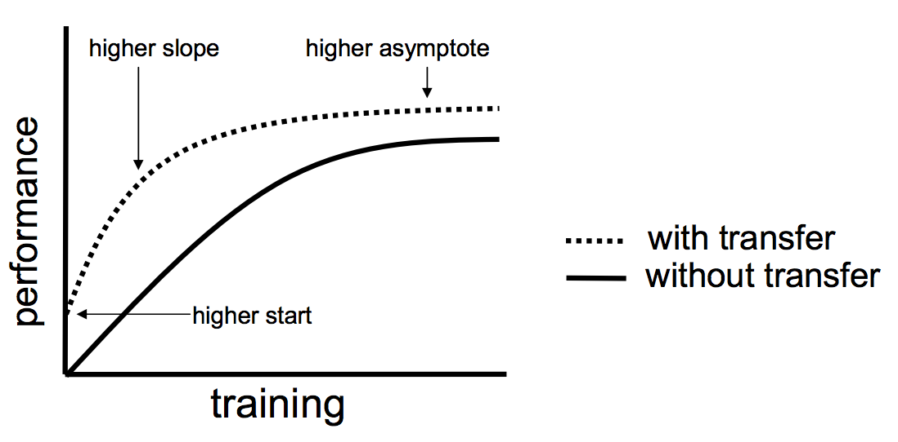

# Distributed Deep Reinforcement Learning  for Autonomous Driving: Transfer Learning

### How to speed up training?:

Training this model from scratch can take more than a one, on a powerfull GPU, but using a technique called Transfer Learning you can leverage knowledge from a model you trained previously and apply it to this model. 

In this repo: [E2EDL-SIM](https://github.com/marianomatelo/E2EDL-Sim )

We generated a model capable of steering on the road, we want to transfer this capacity and the way it learning to our new model so it doesn't have to start from scratch.

We were able to reduce training times from days to hours.

### Transfer Learning:

It is a popular approach in deep learning where pre-trained models are used as the starting point on computer vision and natural language processing tasks given the vast compute and time resources required to develop neural network models on these problems and from the huge jumps in skill that they provide on related problems.

## Example:

